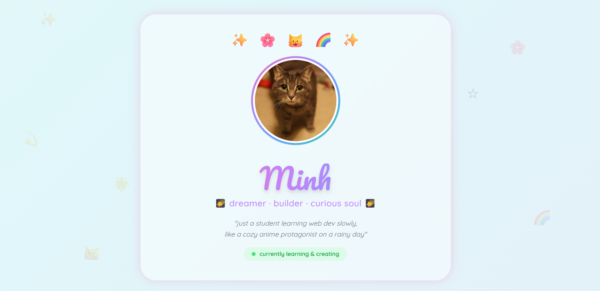

# My Website

A simple personal website made with HTML and Tailwind CSS.

## About

I made this project to learn more about frontend development and try building my own website from scratch.

The website is pretty simple, but it helped me get familiar with page layouts, styling, and responsive design.

## Built With

* HTML
* Tailwind CSS

## Features

* Responsive layout
* Gradient background
* Glassmorphism effects
* Simple personal landing page

## Screenshot

## What I Learned

* Using Tailwind CSS
* Building layouts with HTML
* Making a website responsive
* Working with colors and visual design

## Future Plans

* Add animations
* Improve mobile layout
* Add more pages
* Turn it into a portfolio

## AI Usage

Some design ideas were inspired by AI tools and online references.

The website itself was built and edited by me and claude.

## Notes

This is one of my first web projects, so there's still a lot I want to improve.
